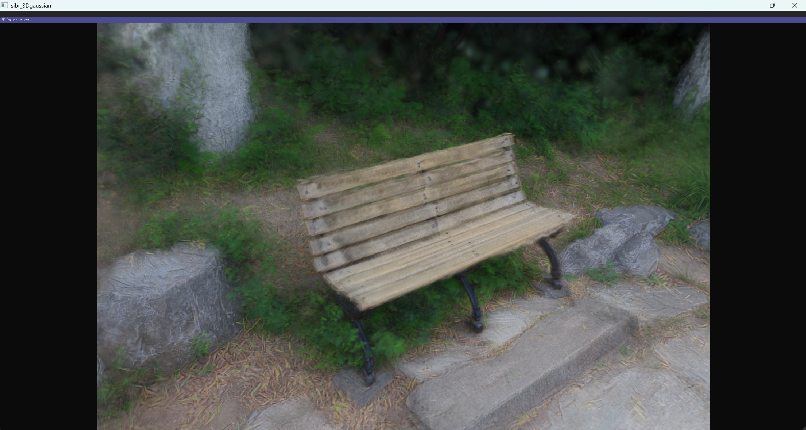
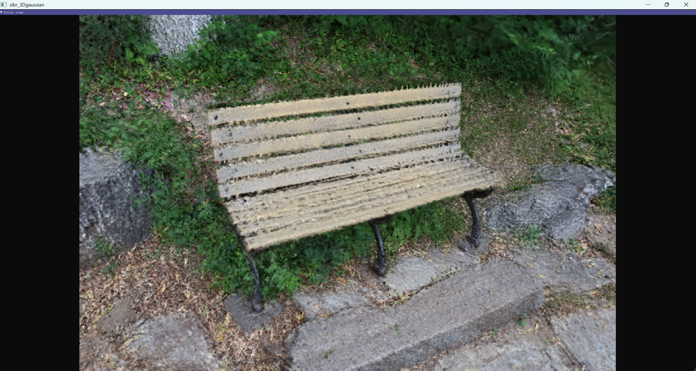
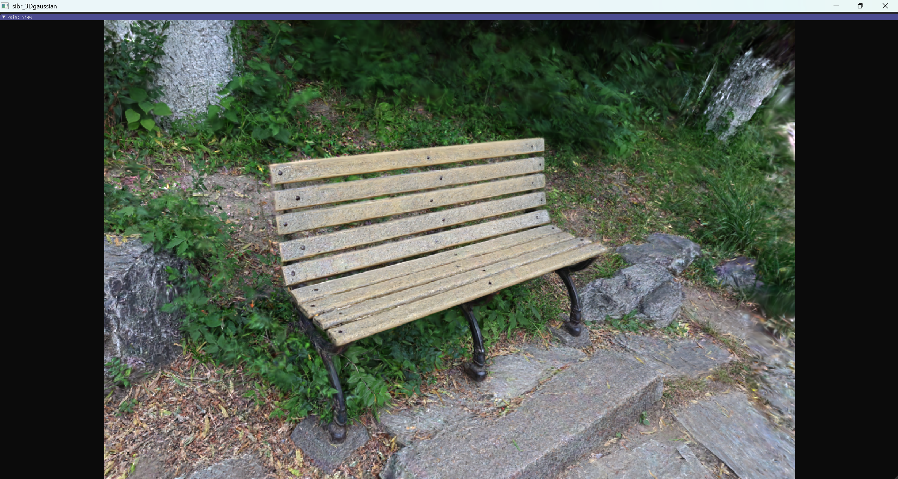

## 实验结果

我们在室内外多个场景中进行了实验。下面展示我们在本仓库提供的场景（室外，16张图）中的实验效果。

首先执行 `scripts/run_da3_and_organize.py`，分辨率（较长边）设为 1024，仅用 207 秒便构建好 COLMAP 数据集并生成了可以用 SIBR Viewers 查看的高斯点云。如下图所示，我们发现 Depth Anything 3 直接生成的高斯点云还原了场景的大致样貌，但是较为模糊。

我们以 Depth Anything 3 直接生成的高斯点云作为初始点云，使用 SparseGS 继续优化，3000 次迭代（约 10 分钟）达到下图中的效果。可以看到高斯点云变清晰，但是噪声仍然严重（我们通过调整参数，避免了明显的重影）。我们认为原因是 Depth Anything 3 本身在估计深度图和相机位姿时有偏差。

如果只使用 Depth Anything 3 生成的 COLMAP 稀疏点云，而不直接使用 Depth Anything 3 生成的高斯点云，并使用 SparseGS 进行 30000 次迭代优化，可以达到下图所示的较为清晰的效果，但是优化时间大约为1小时。

